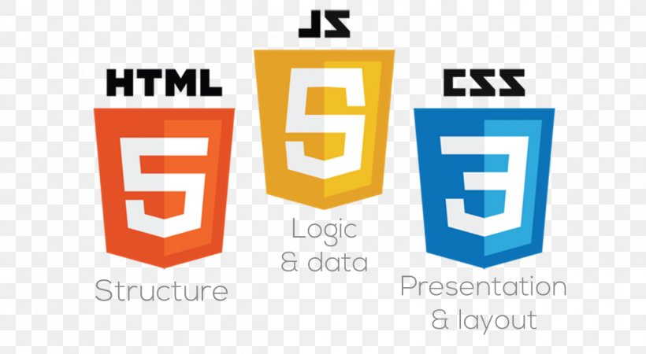

# Project1
in the repo we will learn about  **html** css and js 
## Heading level 2
in the repo will start to add a table wiht the course indexes and links to more details to this subject 

  | #Syntax | Description |
| ----------- | ----------- |
| Header | Title |
| Paragraph | Text |

|             | Syntax      | Description |
| ----------- | ----------- |-------------|
| Header | [Title](./classes/classes1.md) |[title](https://www.example.com)
| Paragraph | Text |

#### manar